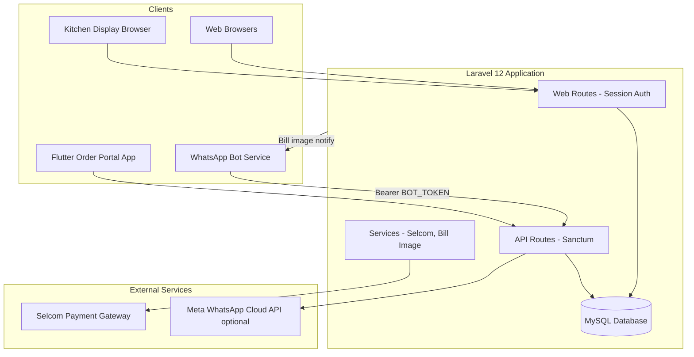
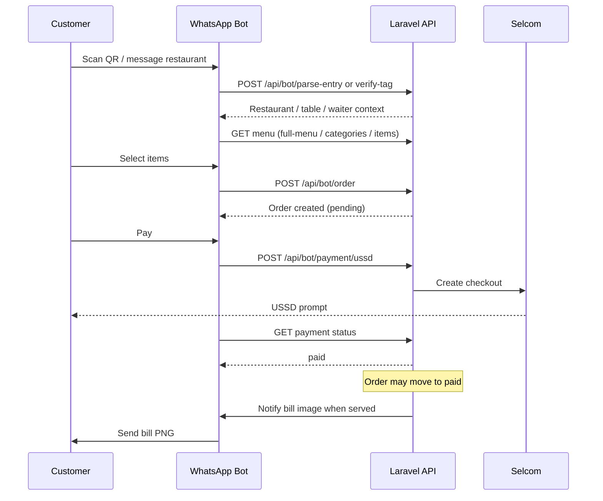
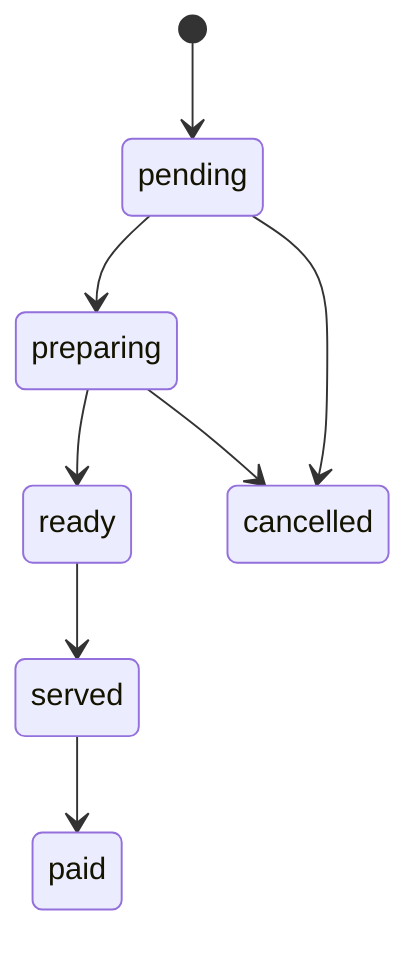
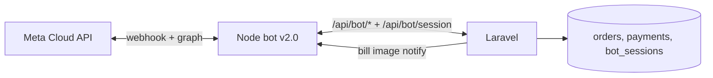
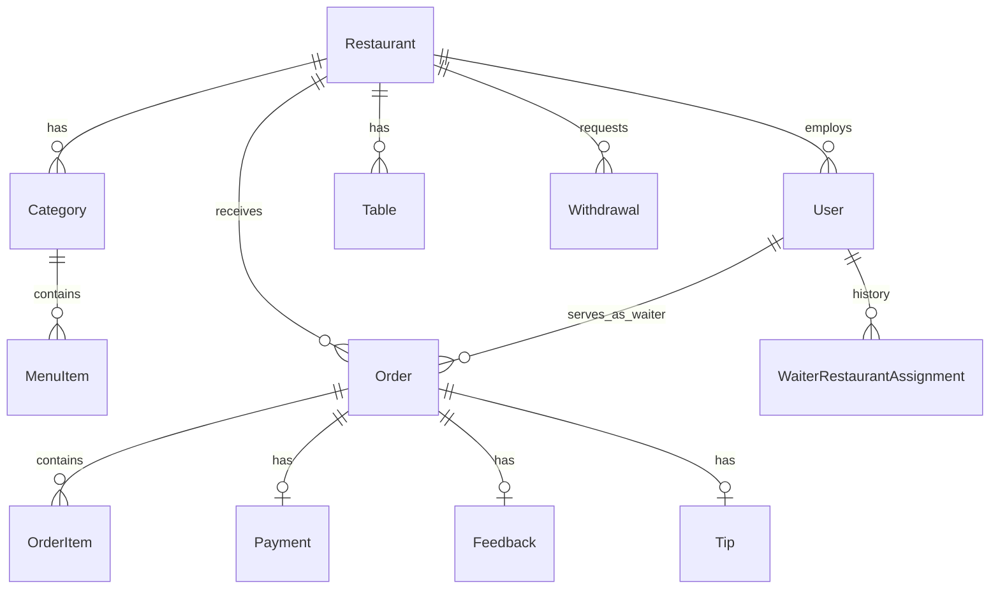

# TIPTAP — System Overview

**TIPTAP** (also referenced as TipTap in code and docs) is a restaurant operations platform that combines **QR codes**, **WhatsApp ordering**, **mobile money payments**, and **role-based web dashboards** into one Laravel backend. Customers order from their phone; managers run the floor; waiters serve tables; platform admins oversee the whole network.

This document describes what the system does, who uses it, how the pieces connect, and where to look in the codebase.

---

## Table of contents

1. [What problem TIPTAP solves](#1-what-problem-tiptap-solves)
2. [High-level architecture](#2-high-level-architecture)
3. [User roles and portals](#3-user-roles-and-portals)
4. [Core modules](#4-core-modules)
5. [How it works — main flows](#5-how-it-works--main-flows)
6. [Order lifecycle](#6-order-lifecycle)
7. [Payments (Selcom)](#7-payments-selcom)
8. [WhatsApp integration](#8-whatsapp-integration)
9. [API surface](#9-api-surface)
10. [Authentication](#10-authentication)
11. [Data model (main entities)](#11-data-model-main-entities)
12. [Technology stack](#12-technology-stack)
13. [Project structure](#13-project-structure)
14. [Configuration and deployment](#14-configuration-and-deployment)
15. [Related documentation](#15-related-documentation)

---

## 1. What problem TIPTAP solves

Traditional restaurants often juggle paper tickets, separate POS systems, and manual payment follow-up. TIPTAP centralizes:

| Need | TIPTAP approach |
|------|-----------------|
| Customer ordering | QR scan or WhatsApp chat → digital menu → order in system |
| Kitchen visibility | Kitchen Display System (KDS) via token URL |
| Payments | Selcom mobile money (USSD/wallet) + cash recording |
| Staff coordination | Manager live board, waiter claims, call-waiter / request-bill |
| Multi-venue platform | Super admin manages many restaurants from one panel |
| Payouts | Restaurants request withdrawals; admin approves |

**Typical journey (marketing):** Scan QR → menu opens in WhatsApp → place order → pay on phone → kitchen prepares → bill/receipt via WhatsApp when served.

---

## 2. High-level architecture



**Important:** The WhatsApp **bot runtime** (e.g. Node/Baileys) is typically a **separate service**. This repository is the **Laravel API + web portals**. The bot calls `/api/bot/*` with a Sanctum token generated in the admin panel.

---

## 3. User roles and portals

Roles are defined with **Spatie Laravel Permission** (`database/seeders/RolesAndPermissionsSeeder.php`).

### Super Admin (`super_admin`)

**Portal:** `/admin/*`

| Capability | Description |
|------------|-------------|
| Dashboard | Platform stats (restaurants, revenue, active orders, withdrawals) |
| Restaurants | List, search, view details, edit, block/unblock, delete |
| Users | Manage managers, waiters, admins; assign roles and restaurants |
| Waiters | Global list and search by `TIPTAP-W-xxxxx` code |
| Orders | All orders across restaurants; filter, export CSV |
| Payments | Transaction history and export |
| Withdrawals | Approve or reject restaurant payout requests |
| Bots | Configure bot webhook endpoint; generate `BOT_TOKEN` |
| Notifications | Send system messages to restaurants or all |
| Settings | System name, commission, WhatsApp number, webhook secret |

### Manager (`manager`)

**Portal:** `/manager/*` — scoped to **one restaurant** (`users.restaurant_id` + `RestaurantScope` on models).

| Capability | Description |
|------------|-------------|
| Dashboard | Today’s revenue, active orders, quick stats |
| Live orders | Kanban board: create, update status, delete, send WhatsApp bill |
| Order history | Past orders, export |
| Menu | Categories and menu items (CRUD) |
| Tables | Table list, QR codes, assign waiters |
| Waiters | Link/unlink waiters by global code, employment type, order-portal password |
| Payments | View payments, initiate Selcom, check status |
| Payroll | Record salary payments, history, export |
| Feedback | Customer ratings and comments |
| Reports | Performance reports and export |
| Menu image | Upload image sent to WhatsApp bot for menu display |
| API / Selcom | Per-restaurant Selcom credentials and connection test |
| Kitchen | Kitchen display token for KDS URL |

**Registration:** `/register-restaurant` creates a restaurant + manager account and logs in.

### Waiter (`waiter`)

**Portal:** `/waiter/*`

| Capability | Description |
|------------|-------------|
| Dashboard | Stats when **linked** to a restaurant |
| Orders | View and update order status (when linked) |
| Menu | Read-only menu for the restaurant |
| Tips & ratings | View earnings feedback |
| Profile | Update details |
| Salary slips | PDF slips by period |
| Customer requests | Complete “call waiter” / “request bill” from customers |

**Global identity:** Each waiter gets a code like `TIPTAP-W-00001` (`global_waiter_number`). Managers **link** them to a venue; history is stored in `waiter_restaurant_assignments`.

**Registration:** `/register-waiter` — account without restaurant until linked.

**Middleware:** `waiter.linked` blocks operational features until `restaurant_id` is set.

### Bot service (`bot_service`)

Not a human login. A system user (`bot@taptap.com`) holds a **Sanctum API token** used by the external WhatsApp bot to call `/api/bot/*`.

### Order Portal (password-based)

**Routes:** `/order-portal/*` + `/api/order-portal/*`

Lightweight access for staff who only need live orders and payments (no full waiter account). Manager generates a password; staff use web or the **Flutter app** (`tiptap_live_order/`).

---

## 4. Core modules

### Restaurants

- Profile: name, location, phone, active flag
- Branding: `tag_prefix` for QR entry parsing
- Payments: Selcom vendor ID, API key/secret, live/sandbox flag
- Ops: `support_phone`, `menu_image`, `kitchen_token`

### Menu

- **Categories** and **menu items** (name, price, description, availability)
- Scoped per restaurant
- Manager manages via web; bot reads via API

### Orders & order items

- Table number, customer name/phone, WhatsApp JID
- Line items with quantity and price
- Status workflow (see [Order lifecycle](#6-order-lifecycle))
- Bill image push when status is `served` (signed URL)

### Payments

- Linked to orders or “quick payment” without order
- Methods: cash, USSD, card, etc. (`payments.method`)
- Status: `pending`, `paid`, `failed`, `completed`

### Tables & QR

- Physical tables with `table_tag`
- QR encodes restaurant/waiter/table context for the bot (`parse-entry`, `verify-tag`)

### Customer requests

- Types such as **call waiter** and **request bill**
- Appear on waiter/manager UIs for fulfillment

### Feedback & tips

- Post-order rating and comment
- Optional tips linked to waiters/orders
- Bot and API can submit; managers view feedback index

### Payroll

- Manager records salary payments per waiter
- Waiter views/downloads salary slip PDFs (DomPDF)

### Withdrawals

- Restaurant requests payout
- Admin approves/rejects with notes and audit log

### Kitchen Display System (KDS)

- Public URL: `/kitchen/display/{kitchen_token}`
- No login — token on `restaurants.kitchen_token`
- JSON APIs for order columns by status

### Admin bots & notifications

- Register bot service URL
- Rotate Sanctum token written to `.env` as `BOT_TOKEN`
- Broadcast notifications to all or one restaurant

### System settings

- Key/value settings (general, financial, API)
- Updated from admin settings page

---

## 5. How it works — main flows

### A. Customer orders via WhatsApp



### B. Manager runs the floor

1. Logs in at `/login` → redirected to `/manager/dashboard`.
2. Opens **Live orders** — sees columns by status.
3. Creates manual orders or moves cards (preparing → served).
4. Sends WhatsApp bill from an order when ready.
5. Manages menu, tables, waiters, and Selcom settings as needed.

### C. Waiter workflow

1. Registers at `/register-waiter` → receives `TIPTAP-W-xxxxx`.
2. Manager searches code and **links** waiter to restaurant.
3. Waiter dashboard unlocks: claim orders, complete customer requests, hand over tables.
4. Views tips, ratings, and salary slips.

### D. Super admin oversight

1. Monitors all restaurants, orders, and payments.
2. Approves withdrawal requests.
3. Maintains bot token and system settings.
4. Can block restaurants or edit any user.

### E. Order Portal (web or Flutter)

1. Manager generates order-portal password for a waiter slot.
2. Staff logs in at `/order-portal/login` or uses Flutter app.
3. Same live-order and Selcom flows as manager board (scoped by session).

---

## 6. Order lifecycle

Statuses used across manager live orders, order portal, and APIs:

| Status | Meaning |
|--------|---------|
| `pending` | Order placed, not started in kitchen |
| `preparing` | Kitchen is working on it |
| `ready` | Ready for pickup/serve (kitchen/KDS) |
| `served` | Delivered to table — triggers bill image push to WhatsApp if JID present |
| `paid` | Payment completed |
| `cancelled` | Cancelled |

Admin order UI may also use `completed` for legacy/display; operational flow centers on **pending → preparing → served → paid**.



---

## 7. Payments (Selcom)

**Service:** `App\Services\SelcomService`

- **Live:** `https://apigw.selcommobile.com/v1`
- **Sandbox:** `https://apigwtest.selcommobile.com/v1`
- Signing: HMAC-SHA256 (`Digest` header)

Each **restaurant** stores its own Selcom credentials. Payments are initiated from:

- Manager web (`/manager/payments`)
- Order portal (`/order-portal` + API)
- REST API v1 (`/api/v1/payments/...`)
- WhatsApp bot (`/api/bot/payment/...`)

Payment records live in the `payments` table with `transaction_reference`, `method`, and `status`.

---

## 8. WhatsApp integration

The bot was migrated from **Baileys (WhatsApp Web)** to the **Meta Cloud API** in `tiptopbot v2.0`. The Laravel application is unchanged on the business-logic side; only the transport layer in the Node bot changed.



### Integration paths

| Path | Purpose |
|------|---------|
| **Bot business API** (`/api/bot/*`) | Bot drives menu, orders, payments, feedback, tips, tables, call waiter |
| **Bot session API** (`/api/bot/session`) | Persists conversation state in `bot_sessions` (replaces in-memory map) |
| **Meta webhook** (`/api/whatsapp/webhook`) | Optional: Meta posts here, Laravel verifies + forwards to bot's `/inbound`. Can also be skipped by pointing Meta directly at `https://<bot>/webhook`. |
| **Bill image push** (`/notify` on the bot) | Laravel calls the bot when an order reaches `served`; the bot delivers via Cloud API |

### Configuration

`config/services.php → 'whatsapp'`:

| Key | Env var | Purpose |
|-----|---------|---------|
| `phone_number_id` | `WHATSAPP_PHONE_NUMBER_ID` | Meta phone number id |
| `access_token` | `WHATSAPP_ACCESS_TOKEN` | Long-lived Graph API token |
| `verify_token` | `WHATSAPP_VERIFY_TOKEN` | Used in webhook handshake |
| `app_secret` | `WHATSAPP_APP_SECRET` | HMAC signature verification |
| `graph_version` | `WHATSAPP_GRAPH_VERSION` | Default `v20.0` |

`config/whatsapp.php` retains bill push settings:

- `bot_notify_url` — Where Laravel sends `bill_image` events
- `bot_notify_secret` — Shared `X-Bot-Secret` header
- `bill_image_base_url` — Public base URL for the rendered PNG

### Bill image flow

`BillImageController` + `BillImageService` render an order bill as PNG. When status moves to `served`, the **`SendBillImageToCustomer`** job POSTs to `bot_notify_url`. The bot's `/notify` endpoint then sends an `image` message via Cloud API (no Baileys).

### Persistent sessions

`bot_sessions` table stores per-customer state so cart, language, and current screen survive bot restarts:

| Column | Type | Notes |
|--------|------|-------|
| `wa_id` | string (unique) | Phone digits only |
| `state` | string | e.g. `HOME`, `PAYMENT_SUMMARY` |
| `lang` | string(2) | `en` (default) or `sw` |
| `data` | json | Cart, restaurant_id, table_id, … |
| `last_message_at` | timestamp | For idle cleanup |

CRUD via `App\Http\Controllers\Api\BotSessionController` (auth: same `bot_service` Sanctum token).

### Admin

`/admin/bots` — set the bot's notify URL and rotate `BOT_TOKEN`.

---

## 9. API surface

Base file: `routes/api.php`. Detailed lists: `docs/API_ROUTES.md`, `docs/WAITER_API.md`, `docs/ORDER_PORTAL_API.md`.

### Public

| Endpoint | Auth | Notes |
|----------|------|-------|
| `POST /api/auth/login` | — | Returns Sanctum token |
| `POST /api/auth/register-waiter` | — | Mobile registration |
| `GET/POST /api/whatsapp/webhook` | — | Meta verification + inbound |

### Authenticated (`auth:sanctum`)

| Prefix | Consumer |
|--------|----------|
| `/api/waiter/*` | Waiter mobile app |
| `/api/v1/*` | General mobile/API clients (orders, payments, menu) |
| `/api/v1/manager/*` | Manager mobile tools |
| `/api/bot/*` | WhatsApp bot (`bot_service` role) |
| `/api/order-portal/*` | Order portal (session + `order.portal` middleware) |

### Web (session)

| Prefix | Role middleware |
|--------|-----------------|
| `/admin/*` | `super_admin` |
| `/manager/*` | `manager` |
| `/waiter/*` | `waiter` (+ `waiter.linked` on subset) |
| `/order-portal/*` | Order portal session |

---

## 10. Authentication

| Method | Route / mechanism | Users |
|--------|-------------------|--------|
| Web session | `/login`, `/logout` | Admin, manager, waiter |
| Role redirect | `/dashboard` | Sends user to correct portal |
| Restaurant signup | `/register-restaurant` | New manager + restaurant |
| Waiter signup | `/register-waiter` | New waiter (unlinked) |
| API token | `POST /api/auth/login` | Mobile, bot (separate token for bot) |
| Order portal | `/order-portal/login` | Password from manager |
| Bot token | Admin → Generate token | Writes `BOT_TOKEN` to `.env` |

**Authorization:** Middleware aliases in `bootstrap/app.php`: `role`, `permission`, `waiter.linked`, `order.portal`.

**Multi-tenancy:** Models use `RestaurantScope` so managers/waiters only see their `restaurant_id` data. Super admin has no `restaurant_id` and sees all.

---

## 11. Data model (main entities)



| Model | Role |
|-------|------|
| `User` | Login, roles, waiter codes, restaurant link |
| `Restaurant` | Venue, Selcom, kitchen token, branding |
| `Category`, `MenuItem` | Menu |
| `Table` | QR, table tag, waiter assignment |
| `Order`, `OrderItem` | Orders and lines |
| `Payment` | Money transactions |
| `CustomerRequest` | Call waiter / request bill |
| `Feedback`, `Tip` | After service |
| `WaiterSalaryPayment` | Payroll |
| `WaiterRestaurantAssignment` | Link/unlink history |
| `OrderPortalPassword` | Portal credentials |
| `Withdrawal` | Payout requests |
| `Bot` | Bot service registry |
| `Setting` | System configuration |
| `AdminActivityLog`, `Activity` | Audit / activity feeds |

---

## 12. Technology stack

| Layer | Technology |
|-------|------------|
| Runtime | PHP 8.2+ (project tested on 8.5) |
| Framework | Laravel 12 |
| Database | MySQL (via Eloquent) |
| Auth API | Laravel Sanctum 4 |
| Roles | spatie/laravel-permission |
| Frontend build | Vite 7 + Tailwind CSS v4 |
| UI | Blade templates, Lucide icons, Alpine.js patterns |
| PDF | barryvdh/laravel-dompdf |
| Tests | Pest 4 |
| Code style | Laravel Pint |
| Mobile | Flutter (`tiptap_live_order/`) — Order Portal client |
| Payments | Selcom Mobile Money API |

**Note:** Livewire is in `composer.json` but the main portals use Blade + Vite, not Livewire components.

---

## 13. Project structure

```
TAPTAP_sauth/
├── app/
│   ├── Http/Controllers/
│   │   ├── Admin/          # Super admin portal
│   │   ├── Manager/        # Restaurant manager portal
│   │   ├── Waiter/         # Waiter portal
│   │   ├── OrderPortal/    # Password-based live orders
│   │   ├── Api/            # Sanctum APIs (V1, Waiter, Bot, Webhook)
│   │   └── Auth/           # Login / registration
│   ├── Models/             # Eloquent + RestaurantScope
│   ├── Services/           # SelcomService, BillImageService, …
│   ├── Jobs/               # e.g. SendBillImageToCustomer
│   └── helpers.php         # public_asset() for static URLs
├── bootstrap/app.php       # Middleware, routes, CSRF exceptions
├── config/                 # app, whatsapp, sanctum, permission, …
├── database/
│   ├── migrations/
│   └── seeders/            # RolesAndPermissionsSeeder, DatabaseSeeder
├── docs/                   # API docs, deploy guides, this file
├── public/
│   ├── images/             # logo, login-bg, flags, marketing
│   ├── build/              # Vite compiled assets (build on deploy)
│   └── favicon*.png
├── resources/views/        # Blade by role
├── routes/web.php, api.php
├── tests/Feature, tests/Unit
└── tiptap_live_order/      # Flutter order portal app
```

**Entry point:** `/` shows the public landing page (`welcome`). Login is at `/login`.

---

## 14. Configuration and deployment

### Environment (`.env`)

| Variable | Purpose |
|----------|---------|
| `APP_URL` | Must be production domain (affects URLs and emails) |
| `ASSET_URL` | Optional CDN or subfolder prefix |
| `DB_*` | Database connection |
| `BOT_TOKEN` | Sanctum token for WhatsApp bot (from admin UI) |
| `WHATSAPP_*` | Bot notify URL, bill image base URL |
| Per-restaurant Selcom | Stored in `restaurants` table, not only `.env` |

### Deploy checklist

1. Point web server **document root** to `public/`.
2. Set `APP_URL=https://your-domain.com` and run `php artisan config:cache`.
3. Run `composer install --no-dev`, `php artisan migrate --force`.
4. Run `npm ci && npm run build` (creates `public/build/` for CSS/JS).
5. Run `php artisan storage:link` for uploaded profile/menu images.
6. Ensure static files exist: `public/images/logo.png`, favicons, `public/images/flags/za.svg`.

See **`docs/DEPLOY_ASSETS.md`** for logo/favicon and Vite troubleshooting.

### Static assets

Blade uses `public_asset()` for logos and favicons so images work even when `APP_URL` is still `localhost` during setup.

---

## 15. Related documentation

| Document | Contents |
|----------|----------|
| [API_ROUTES.md](./API_ROUTES.md) | Full API route reference |
| [WAITER_API.md](./WAITER_API.md) | Waiter mobile endpoints |
| [ORDER_PORTAL_API.md](./ORDER_PORTAL_API.md) | Order portal API |
| [WAITER_MANAGER_LINK_SYSTEM.md](./WAITER_MANAGER_LINK_SYSTEM.md) | TIPTAP-W codes and linking |
| [WHATSAPP_BOT_WELCOME.md](./WHATSAPP_BOT_WELCOME.md) | Bot onboarding flow |
| [DEPLOY_ASSETS.md](./DEPLOY_ASSETS.md) | Production assets and Vite |
| [STORAGE_PATHS.md](./STORAGE_PATHS.md) | Upload paths and serving files |
| [TAPTAP_Feature_Updates_Request.md](./TAPTAP_Feature_Updates_Request.md) | Feature roadmap notes |

---

## Quick reference

| Question | Answer |
|----------|--------|
| Who is this for? | Restaurants in Africa (TZS/Selcom, WhatsApp-first UX) |
| Default login URL | `/login` |
| How are restaurants added? | Self-registration or super admin |
| How do waiters join? | Self-register → manager links by code |
| How do customers order? | WhatsApp bot (primary) or staff-entered orders |
| How are payments taken? | Selcom USSD/wallet + cash |
| Where is the bot code? | External service; this repo is the API backend |
| Mobile app in repo? | `tiptap_live_order/` — Order Portal only |

---

*Last updated from codebase review — Laravel 12, TIPTAP_sauth repository.*
